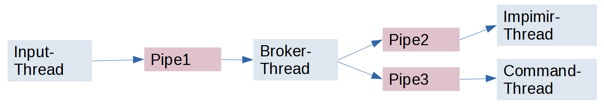

# Threads and Pipes Exercise

This project contains the implementation of the threads and pipes exercise proposed at the Dstributed Systems class of Computer Engineering at Federal University of Rio Grande.

## Problem

We had to run four different threads: one reading an keyboard input and putting on a pipe, another one reading the pipe of inputs and distributing to two distinct pipes, and two threads reading the last pipes to print the inputs with different identifications.

## Contents

### Pipes and Threads

The pipes and threads directories contains the pipes txt files, libraries and source codes fundamental to the system working.

### Run File

The run.sh file compiles and executes the project.

### Main Function

The main function creates the four threads and runs an infinity loop.

## Running

To run the project just run the following command:

> sh run.sh
